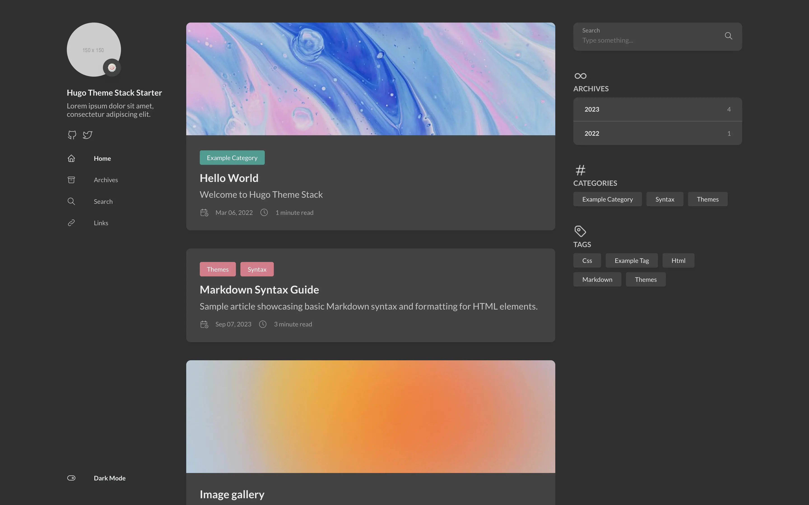
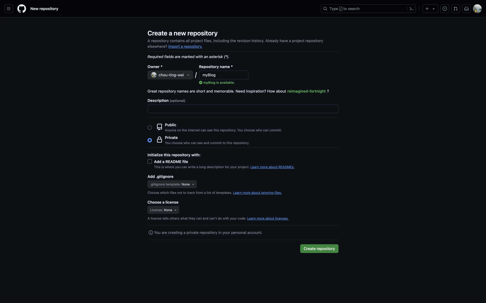
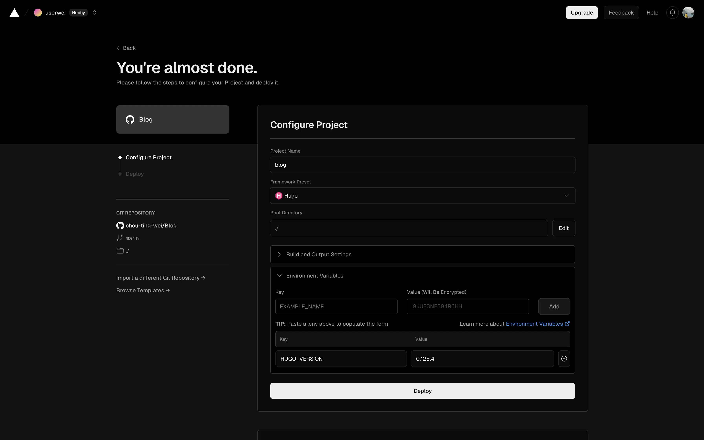
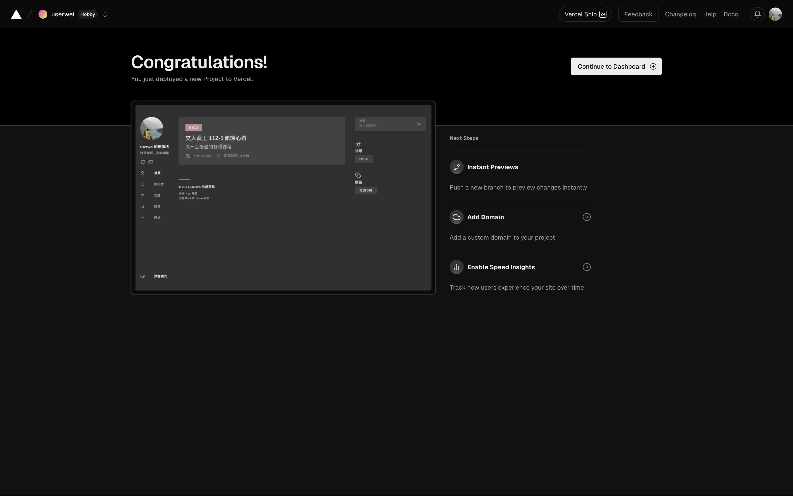
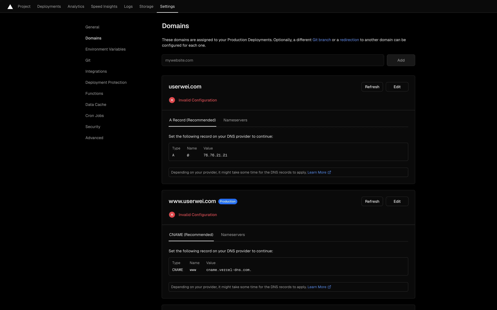
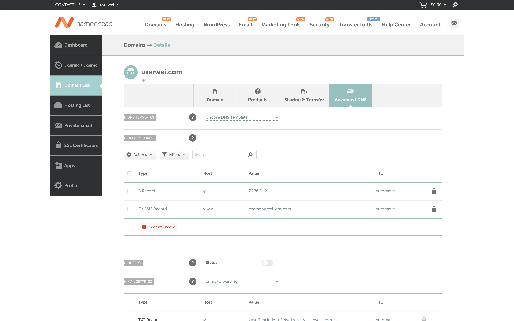
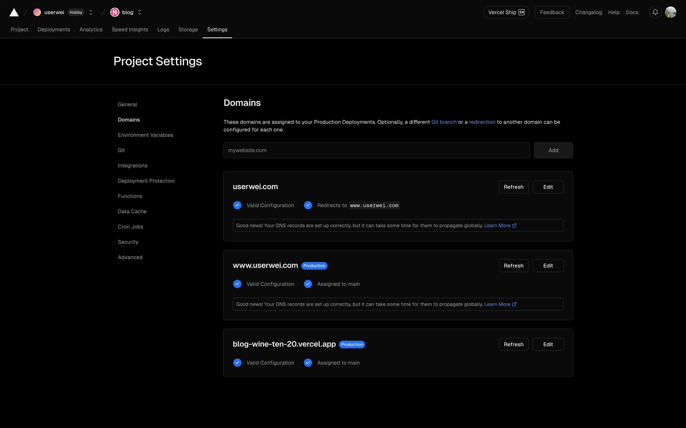
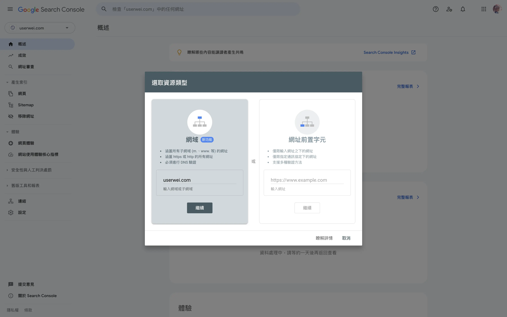
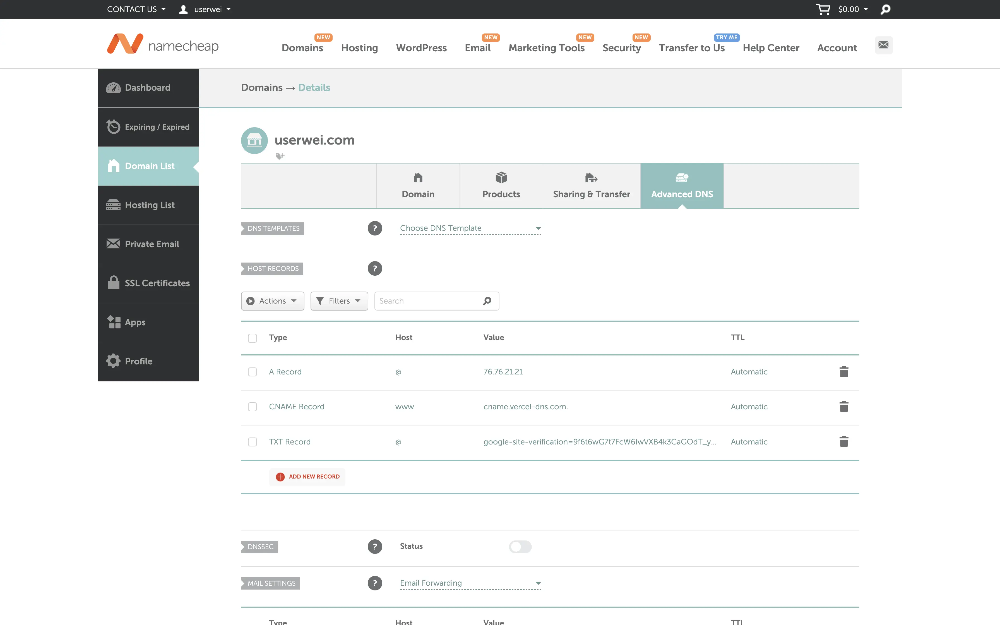

# 利用 Hugo 與 Vercel 建立個人網頁

## Hugo

[Hugo](https://gohugo.io/) 是基於 Go 語言開發的靜態網站生成器，號稱為世界上最快的網站建構工具。除了生成網頁的速度極快，Hugo 也有許多主題可供選擇，並支援實時渲染、多語系切換的功能，可以優化文章的寫作與網站架設的體驗。下方為比較 Hugo 和 Hexo 兩種靜態網站生成器的表格：

| 功能             | Hugo              | Hexo              |
| ---------------- | ----------------- | ----------------- |
| **程式語言**     | Go                | Node.js           |
| **速度**         | 非常快            | 中等              |
| **主題 / 插件**  | 多                | 非常多            |
| **內容格式**     | Markdown、HTML 等 | Markdown、HTML 等 |
| **學習難度**     | 中等              | 適合初學者        |
| **依賴性**       | 無                | 需要 Node.js      |
| **搜尋引擎優化** | 內建支援          | 需要透過插件      |
| **多語言支援**   | 有                | 有                |

### 安裝 Hugo

由於 Hugo 並未提供 GUI，因此需要由終端機安裝，以下是 Hugo 官方提供在不同系統下的 [安裝方法](https://gohugo.io/installation/)：

1. Windows

   ```sh
   choco install hugo-extended
   ```

2. macOS

   ```sh
   brew install hugo
   ```

3. Linux

   ```sh
   sudo snap install hugo
   ```

在安裝完成後使用以下指令測試 Hugo 是否安裝成功：

```sh
hugo version
```

### 安裝 Git

至 [Git](https://git-scm.com/) 官網下載安裝。

### 初始化環境

選擇網頁存放的資料夾，並輸入以下指令新增網頁：

```sh
hugo new site <site_name>
```

完成後會在 `<site_name>` 資料夾中生成以下的檔案：

```
├── archetypes
│   └── default.md
├── assets
├── content
├── data
├── hugo.toml
├── i18n
├── layouts
├── static
└── themes
```

為了方便推送到 GitHub，我們先進入剛剛生成的資料夾初始化整個 Git 儲存庫：

```sh
cd <site_name>
git init
```

### 選擇主題

在 [Hugo Themes](https://themes.gohugo.io/) 中有提供許多類型的主題，可以依個人喜好挑選，這裡我選擇 [Stack](https://stack.jimmycai.com/) 主題作為範例。  


1.  在網站的根目錄中打開終端機，利用 `git submodule` 將主題下載至 `themes` 資料夾中：
    ```sh
    git submodule add https://github.com/CaiJimmy/hugo-theme-stack/ themes/hugo-theme-stack
    ```
2.  刪除 `hugo.toml` 檔案並將 `themes/hugo-theme-stack` 中的 `config.yaml` 複製到根目錄中，在此檔案的最上方加入以下內容：
    ```yaml
    baseurl: https://example.com
    languageCode: zh-tw
    theme: hugo-theme-stack
    pagination:
      pagerSize: 5
    title: <blog_title>
    ```
3.  其他設定可以參考 Stack 官方提供的 [Config](https://stack.jimmycai.com/config/) 依個人喜好修改：

    - 網站 icon 設定  
      將 `favicon.ico` 置於 `static` 的資料夾中，並在 `config.yaml` 修改以下內容：

      ```yaml
      params:
        favicon: favicon.ico
      ```

    - 側邊欄設定

      1. 將自己的大頭貼`avatar.webp`置於`assets/img`資料夾中（若無則自行新增），並在`config.yaml` 修改以下內容：
         ```yaml
         params:
           sidebar:
             compact: false
             emoji:
             subtitle: <subtitle>
             avatar:
               enabled: true
               local: true
               src: img/avatar.webp
         ```
      2. 在副標題下方可以加上連結提供導向至自己的 GitHub 等網站，在 `config.yaml` 最下方新增以下內容：
         ```yaml
         menu:
           social:
             - identifier: github
               name: GitHub
               url: <github_link>
               params:
               icon: brand-github
         ```
      3. 若要新增導覽列則可參考 `themes/hugo-theme-stack/exampleSite`中的檔案內容與架構，修改後`content` 資料夾中的檔案架構將如下所示：
         ```
         ├── _index.md
         ├── categories
         ├── page
         │   ├── about
         │   │   └── index.md
         │   ├── archives
         │   │   └── index.md
         │   ├── links
         │   │   └── index.md
         │   └── search
         │       └── index.md
         └── post
         ```

    - 文章設定  
      修改以下 `config.yaml` 的內容讓文章可以支援 LaTeX，並加上目錄、閱讀時長、預設 CC 授權等內容：
      ```yaml
      params:
        article:
        math: true
        toc: true
        readingTime: true
        license:
          enabled: true
          default: CC BY-NC-SA 4.0
      ```
    - 留言設定

      1. 至 [Disqus](https://disqus.com/) 建立新帳戶，並創建新的 site，從設定中查詢 shortname。
      2. 修改以下 `config.yaml` 的內容以增加留言功能（將 `<shortname>` 替換為 Disqus 設定中的 shortname）：

         ```yaml
         disqusShortname: <shortname>
         params:
           comments:
             enabled: true
             provider: disqus

             disqusjs:
               shortname: <shortname>
               apiUrl:
               apiKey:
               admin:
               adminLabel:
         ```

    - widget 設定  
      修改以下 `config.yaml` 的內容使主頁及文章中顯示搜尋、目錄等小工具：
      ```yaml
      params:
          widgets:
              homepage:
                  - type: search
                  - type: categories
                  params:
                      limit: 10
                  - type: tag-cloud
                  params:
                      limit: 10
              page:
                  - type: search
                  - type: toc
      ```
    - zh-tw 用詞設定  
      將 `themes/hugo-theme-stack/i18n` 中的 `zh-tw.yaml` 複製到 `i18n` 資料夾中，並依需求更改：

      ```yaml
      toggleMenu:
      other: 切換選單
      darkMode:
      other: 深色模式
      ```

### 撰寫文章

Hugo 需要使用 [Markdown](https://www.markdownguide.org/getting-started/) 語法來撰寫文章，這裡採用的方法是為每篇文章都建立一個資料夾，以方便整理資源。

1. 在 `content/post` 的資料夾中新增一個以新文章名稱命名的資料夾（盡量使用英文，字與字間不要有空格）。
2. 在資料夾中新增 `index.md` 的檔案，`content/post` 資料夾中的檔案架構如下所示：
   ```
   ├── myPost
   │   └── index.md
   └── myPost2
       └── index.md
   ```
3. 利用 [Visual Studio Code](https://code.visualstudio.com/) 等文字編輯器編輯 `index.md`，以下為基本的檔案內容（除文章屬性架構外皆可進行修改）：

   ```md
   ---
   title: myPost
   slug: my-post
   date: 2024-05-20
   description: My first post
   categories:
     - Blog
   tags:
     - First
   ---

   ## Hugo Blog

   content
   ```

### 預覽 Hugo 網頁

透過內建的網頁即時預覽功能，可以讓我們了解網頁目前的內容。

1. 在終端機中輸入以下指令：
   ```
   hugo server -D
   ```
2. 若網頁沒有錯誤，終端機會顯示以下內容：
   ```
   Serving pages from disk
   Running in Fast Render Mode. For full rebuilds on change: hugo server --disableFastRender
   Web Server is available at http://localhost:1313/ (bind address 127.0.0.1)
   Press Ctrl+C to stop
   ```
3. 在瀏覽器中連上 `http://localhost:1313/` 即可預覽目前的網頁。

### 推送至 GitHub

為了接下來的網頁部署，需要將剛剛所生成的網頁推送到 [GitHub](https://github.com/) 上，具體步驟如下：

1. 在 GitHub 上新開一個儲存庫，並將權限設為私人（Private），其餘設定皆保持原狀。
   
2. 在根目錄中建立 `.gitignore` 檔案，檔案內容如下：
   ```
   public
   resources
   assets/jsconfig.json
   .hugo_build.lock
   ```
3. 複製頁面上儲存庫的網址 `https://github.com/xxx/xxx.git`，並在根目錄中執行以下指令（`<repo_link>` 需替換成儲存庫的網址），將全部檔案推送到 GitHub 儲存庫中：
   ```sh
   git add .
   git commit -m "first commit"
   git branch -M main
   git remote add origin <repo_link>
   git push -u origin main
   ```

## Vercel

[Vercel](https://vercel.com/) 是一個提供網頁的託管服務的平台，類似於 [GitHub Pages](https://pages.github.com/) 但更為強大、快速。另外 Vercel 也可以在有新的 Git 推送時自動化部署新的網頁，並每月提供 100GB 的免費流量，對小型網站架設是一大福音。下方表格為幾個常見網頁託管平台的比較：
| 功能 | Vercel | Netlify | GitHub Pages |
|-----------------|----------------------------------------|---------------------------------------|-------------------------|
| **最適用於** | Next.js 應用 | 靜態網站 | 靜態網站 |
| **部署來源** | GitHub、GitLab、Bitbucket | GitHub、GitLab、Bitbucket | 僅限 GitHub |
| **建構速度** | 極快 | 快 | 較慢 |
| **頻寬限制** | 每月 100GB（免費方案） | 每月 100GB（免費方案） | 無限制 |
| **可靠性保證** | 99.99% | 99.99% | 無 |
| **分析工具** | 內建 | 內建 | 無 |

### 部署網站

1. 至 Vercel 官網以 GitHub 登入。
2. 選擇 `Add New >> Project`，並於左側列表選擇剛剛設定好的 Git Repository。
3. 將 `Framework Preset` 設為 `Hugo`，並點擊展開 `Environment Variables` 加入 `HUGO_VERSION` 與本地端使用的版本（可使用 `hugo version` 指令查詢）：
   
4. 若看到以下畫面即完成網頁的部署。
   

### 連結域名

在後台中可以看到 Vercel 為剛剛部署的網頁提供了一個 `xxx.vercel.app` 網址，如果想更改為其他的自訂網址，則需要自行取得並連結域名。

1. 從 [Cloudflare](https://www.cloudflare.com/)、[Namecheap](https://www.namecheap.com/)、[GoDaddy](https://tw.godaddy.com/) 等網域註冊商取得一個域名。
2. 將 `config.yaml` 中的 `baseurl` 更改為取得的域名 `https://www.xxx.com`：
   ```yaml
   baseurl: <domain_name>
   ```
3. 進入後台 `Settings >> Domains` 加入取得的域名，選擇推薦的加入方式。加入後會顯示以下畫面：
   
4. 依照指示至網域註冊商設定 DNS：
   
5. 回到後台重整後，看到域名的設定都配置成功即完成設置：
   

### 網頁分析設定

在 Vercel 後台的導覽列上可以找到 `Analytics` 與 `Speed Insights` 的選項，可以用來了解目前網頁的成效。

1. 在後台分別同意使用這兩種網頁分析，完成會顯示幾段程式碼需要加入自己的網頁中。
2. 於 `layouts` 資料夾中新增 `_default` 資料夾。
3. 從 `themes/hugo-theme-stack/layouts/_default` 中複製 `baseof.html` 至剛剛新增的 `layouts/_default` 資料夾，檔案架構如下所示：
   ```
   └── layouts
       └── _default
           └── baseof.html
   ```
4. 在 `baseof.html` 的 `<body>` 區塊中新增以下程式碼：
   ```html
   <script>
     window.si =
       window.si ||
       function () {
         (window.siq = window.siq || []).push(arguments);
       };
   </script>
   <script defer src="/_vercel/speed-insights/script.js"></script>
   <script>
     window.va =
       window.va ||
       function () {
         (window.vaq = window.vaq || []).push(arguments);
       };
   </script>
   <script defer src="/_vercel/insights/script.js"></script>
   ```
5. 將更新後的網站 push 至 GitHub，重整 Vercel 後台即可查看網頁分析。

## Google Search Console

[Google Search Console](https://search.google.com/search-console/about) 是由 Google 開發的 SEO 工具，可以提供網站所有者了解索引狀況、搜尋流量等資訊，進而優化網頁的搜索排名。

### 新增網頁資源

1. 登入 Google Search Console 後選擇新增資源，輸入自己取得的域名：
   
2. 在網域註冊商的 DNS 中加上 Google 提供的驗證代碼 `google-site-verification=xxx`：
   
3. 等待所有權驗證成功後即可使用。

### Sitemap 設定

Sitemap 是一種網頁導覽的檔案，它記載所有網頁的連結與架構，讓搜尋引擎能快速理解網站內容架構，其中用途最廣泛的為 XML Sitemap。

1. 在 `config.yaml` 中新增以下設定使網頁自動產生 `sitemap.xml`：
   ```yaml
   sitemap:
     changeFreq: ""
     disable: false
     filename: sitemap.xml
     priority: -1
   ```
2. 將更新後的網站 push 至 GitHub，等待 Vercel 重新建置網頁。
3. 在 Google Search Console 的後台側邊欄選取 `Sitemap` 並新增 `https://www.xxx.com/sitemap.xml`。
4. 提交後狀態顯示成功即完成設定。

### Robots.txt 設定

Robots.txt 是提供給機器人的一組指令，主要是管理網路爬蟲的活動，能夠告訴搜尋引擎檢索器可以存取網站上的哪些網址。

1. 在 `static` 資料夾中新增 `robots.txt`，內容如下：

   ```txt
   User-agent: *
   Disallow:

   Sitemap: https://example.com/sitemap.xml
   ```

2. Disallow 的部分可依個人需求自行增加，這邊簡單舉幾個例子：
   ```txt
   Disallow: /page/
   Disallow: /page/search/
   Disallow: /categories/
   ```
3. 等待 Google Search Console 自行檢索，可在 `設定 >> robots.txt` 中查看，若顯示已擷取即完成設定。
